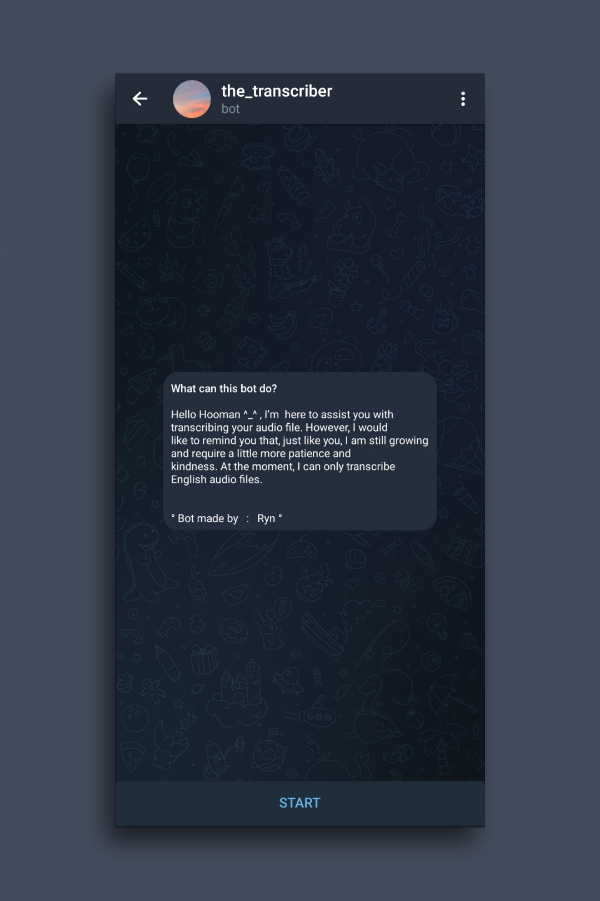
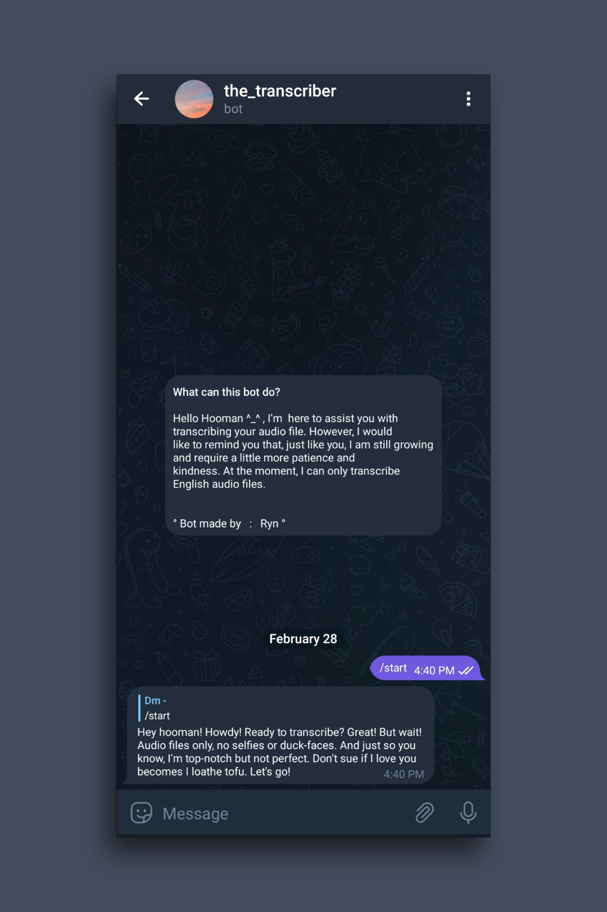
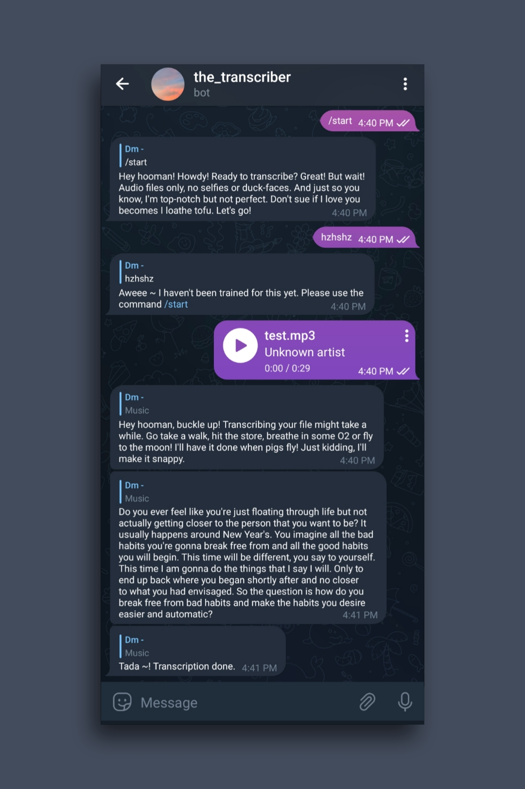

<h1>My-First-Telegram-Bot-Using-Python</h1>

    

Using Python, I developed a Telegram bot that has the capability of transcribing audio files into text with the help of OpenAI Whisper technology.
 
   

   
  
   
    
 
 

Features need to add
<em>To transcribe other languages aside from English audio files</li>
To Support Diarization
To Support Bilingual audio</em> 

